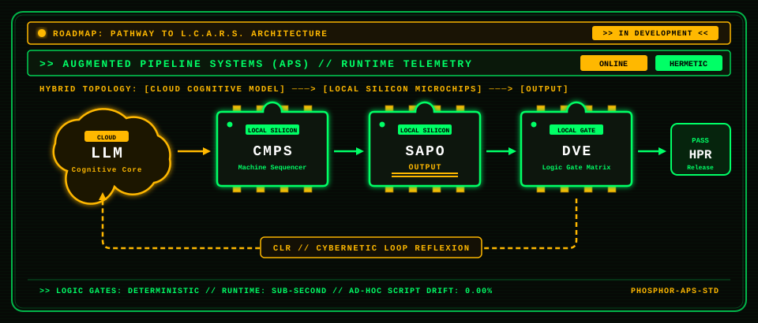

<div align="center">


# Brandon Stensby
### Architect of Augmented Pipeline Systems (APS) • Logic Path Flow Engineering



</div>

---

### Pathway to L.C.A.R.S. Architecture `[IN DEVELOPMENT]`
> **L.C.A.R.S.** — **L**ogic **C**ondensation & **A**utonomous **R**untime **S**equencing  
> *Pioneering closed-loop cybernetic feedback and deterministic micro-architecture.*

```text
               ┌────────────────────────────────────────────────────────┐
               │    ROADMAP: PATHWAY TO L.C.A.R.S. [IN DEVELOPMENT]     │
               └────────────────────────────────────────────────────────┘

     ( Cloud )               ┌────────┐      ┌────────┐      ┌────────┐
     (  LLM  ) ────────────> │  CMPS  │ ───> │  SAPO  │ ───> │  DVE   │ ───┐ [PASS]
     ( Core  )               └────────┘      └────────┘      └────────┘   │
         ▲                                     ======                     │
         │                                    [OUTPUT]                    ▼
         │                                                            ┌────────┐
         │             [ CLR: Cybernetic Loop Reflexion ]             │  HPR   │
         └────────────────────────────────────────────────────────────┤ Release│
                                                                      └────────┘
```

---

### Sub-System Acronym Directory

| Acronym | System Classification | Operational Role |
| :--- | :--- | :--- |
| **L.C.A.R.S.** | **L**ogic **C**ondensation & **A**utonomous **R**untime **S**equencing | **Master Roadmap Goal** — Unified cybernetic operating framework *(In Development)*. |
| **LLM** | **L**arge-scale **L**ogic **M**odel | **Cloud Cognitive Core** — Intent formulation & macro-reasoning. |
| **CMPS** | **C**ondensed **M**achine **P**ipeline **S**equencing | **Local Silicon Sequencer** — Micro-instruction condensation & zero-bloat logic compaction. |
| **SAPO** | **S**equenced **A**ugmented **P**ipeline **O**utput | **Structured Local Pipeline Output** — Deterministic subroutine execution. |
| **DVE** | **D**eterministic **V**erification **E**ngine | **Local Gate Matrix** — Hermetic testing, static analysis & pre-commit gates. |
| **CLR** | **C**ybernetic **L**oop **R**eflexion | **Closed-Loop Feedback** — Self-healing failure telemetry routed back to the cognitive core. |
| **HPR** | **H**ermetic **P**roduction **R**elease | **Final Release Node** — Zero-defect, cold-execution production deployment. |

---

> [!NOTE]
> All systems and transmissions are AI-assisted via Augmented Pipeline Systems (APS).
